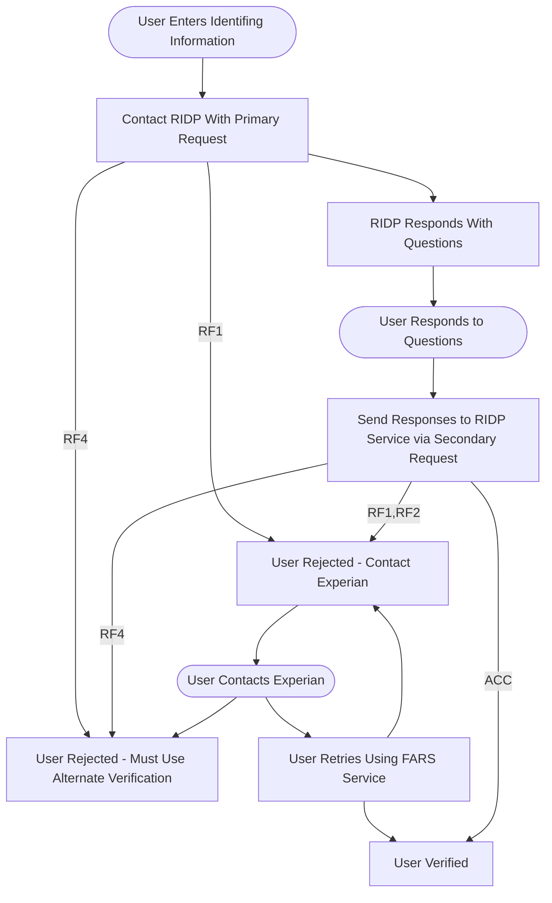

**R**emote **Id**entity **P**roofing (RIDP) and the **F**raud **A**rchive **R**eporting **S**ervice (FARS) are federal hub integration services used to validate the identify of individuals applying for coverage in the ACA individual healthcare market.

RIDP and FARS have two different implementation versions:

1. An April 2020 version which is an XML/XSD based implementation using SOAP HTTP transport.
2. An October 2022 version which is a JSON based implementation using REST HTTP transport.

Both versions of the service are defined fully in corresponding Business Service Definition (BSD) documents. Note these BSDs are **not** included here.

## Overall Flow

Below is the overall flow for the combined orchistration of the RIDP and FARS flows. This diagram applies to both versions. Note that this diagram elides security steps such as obtaining tokens or login credentials for the corresponding web services.

In the below diagram:

1. Squares are webservice request/responses.
2. Rounded nodes indicate actions performed by the user either in an application or over the phone.
3. Labels on the lines indicate the Final Decision Code provided by the web service used in that step.

## April 2020 Version

This version of the service has the following properties:

1. The data payload is XML, and is validated using an XSD.
2. The requests use the SOAP HTTP binding.
3. Security credentials for the webservice is provided via WSS headers in the SOAP payload.
4. Connetions use a server side SSL certificate.

## October 2022 Version

This version of the service has the following properties:

1. The data payload is JSON, and is validated using a JSON schema document.
2. Payload transport is via a RESTful web service.
3. Security credentials for the webservice is provided using OAuth2 with a JWT token.
4. Connections use both a Server and Client side SSL certificate pair.
